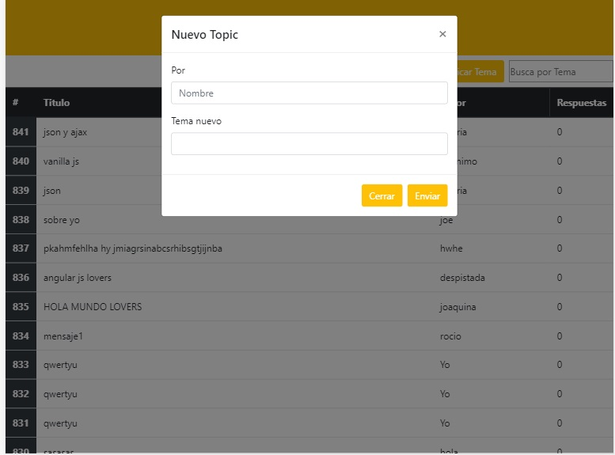
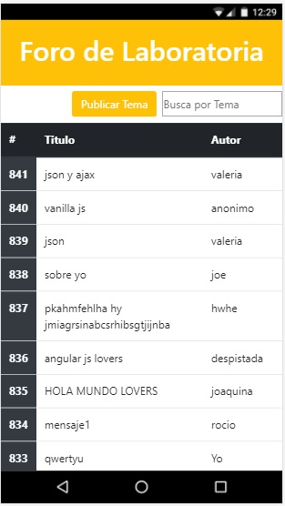

# FORO DE OPINIÓN

## Descripción

El reto de este proyecto consiste en crear un foro utilizando **Foro API**, crearemos un nuevo tema y podremos comentarlo.  

 #### Las condiciones son las siguientes:

* Visualizarse en vista mobile.
* Usar **API Foro API** para los datos.
 

## Herramientas utilizadas 
 1. **HTML 5** : Estructura de la página.
 2. **JQUERY** : Lenguaje de programación.
 4. **AJAX** : Herramienta para manipular la data. 
 4. **BOOSTRAP** : Utilizado en el diseño. 

## Resultado

